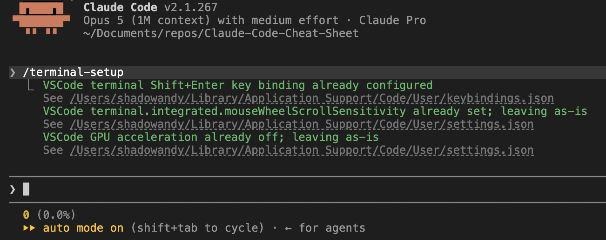
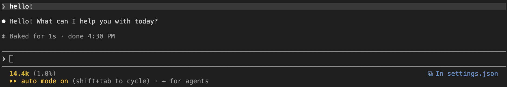
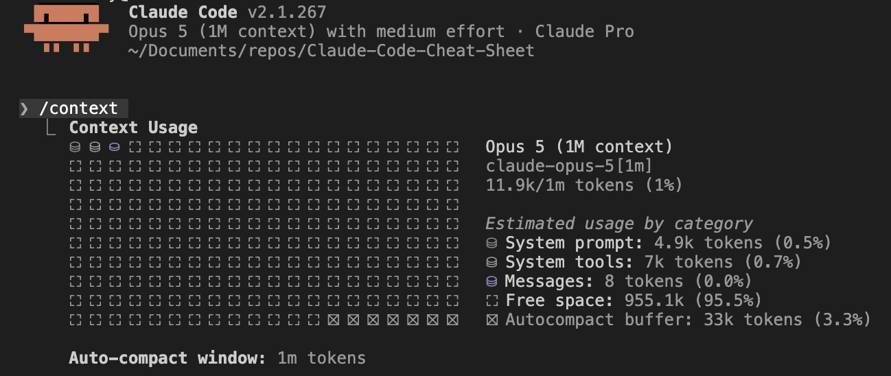
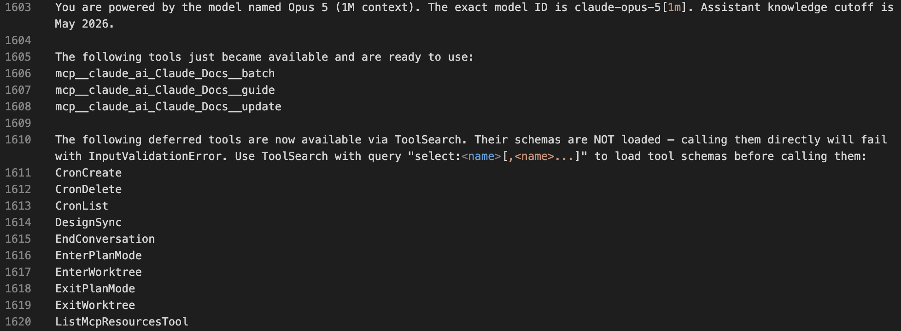

## 1. Basics

### 1.1 Initialize Claude Code's Essential Terminal Configuration

>Do \<Shift\> + \<Enter\> allow you to do multi-line entry into Claude Code Prompt? If no, you are probably missing out on complex prompts that you can do. Fix it.


***Terminal configurations and keybindings done***

| Command | Description |
|--|--|
| `/terminal-setup` | Begin by setting up keybindings for the terminal so that Claude Code recognises key combinations like `<Shift> + <Enter>` means line break for multi-line prompt |

1. In terminal, launch Claude Code using `claude`
2. In Claude Code, use the slash command `/terminal-setup` to setup the essential terminal configuration and fix any abnormal key behaviors
3. Congratulations. You have completed the terminal configuration

### 1.2 Showing Context Size in Status Line

>Unsure if the remaining context window is sufficient for the immediate task? How far are you into the "smart zone"? Visual indication of the size of context window might help.


***Size of context window: 14.4k***

**References**:
 - [Customize your status line](https://code.claude.com/docs/en/statusline)
 -  [ccstatusline](https://www.npmjs.com/package/@wvandaalen/ccstatusline)

#### 1.2.1 Creating ccstatusline Configuration Directory

1. In terminal, create the config directory using the following command:
    ```bash
    mkdir -p ~/.config/ccstatusline
    ```

#### 1.2.2 Configuring ccstatusline

2. In terminal, create the settings file `~/.config/ccstatusline/settings.json` using the following command:
   >Warning: This will overwrite the existing file
    ```bash
    cat > ~/.config/ccstatusline/settings.json << EOF
    {
        "version": 3,
        "lines": [
            [
            {
                "id": "1",
                "type": "context-length",
                "color": "yellow",
                "bold": true,
                "rawValue": true
            },
            {
                "id": "2",
                "type": "custom-text",
                "customText": "(",
                "color": "brightBlack",
                "merge": "no-padding"
            },
            {
                "id": "3",
                "type": "context-percentage",
                "color": "brightBlack",
                "rawValue": true,
                "merge": "no-padding"
            },
            {
                "id": "4",
                "type": "custom-text",
                "customText": ")",
                "color": "brightBlack",
                "merge": "no-padding"
            }
            ],
            [],
            []
        ],
        "flexMode": "full-minus-40",
        "compactThreshold": 60,
        "colorLevel": 2,
        "defaultSeparator": " ",
        "inheritSeparatorColors": false,
        "globalBold": false,
        "powerline": {
            "enabled": false,
            "separators": [" "],
            "separatorInvertBackground": [false],
            "startCaps": [],
            "endCaps": [],
            "autoAlign": false
        }
    }
    EOF
    ```

#### 1.2.3 Adding ccstatusline into Claude Code's Settings

3.  Update `~/.claude/settings.json` to include the following:
	>Note: There could be existing configurations so just append "statusLine" after the last configuration item.

    ```JSON
    {
        "statusLine": {
            "type": "command",
            "command": "npx ccstatusline@latest"
        }
    }
    ```

#### 1.2.4 Testing ccstatusline

4. Launch Claude Code (`claude`)
5. On the lower left hand corner should show the size of context window in the current session. Issuing `/clear` will clear the context
6. Congratulations. You have successfully added ccstatusline to Claude Code's status line

## 2. Killing Context Window Bloat

>`.claude/settings.json` (or `.claude/settings.local.json`) is the file where you configure Claude Code: what tools it can run without asking, which environment variables every session gets, what skills are loaded, and which MCP servers are allowed. 


***New session at 11.9k context after removing the unnecessary items***

**References**:

- [Claude Code Settings Reference](https://code.claude.com/docs/en/settings-reference)
- [Claude Code Tools Reference](https://code.claude.com/docs/en/tools-reference)

The out-of-the-box configuration include skills, MCP connectors and features that you usually do not need. You can actually turn them off to reduce the size of your context window.

### 2.1 Differences between `settings.json` and `settings.local.json`

You can customise your Claude Code through either of these files in your repository:

| Scope |  File | Who it affects | Use it for
|--|--|--|--|
| Shared Project | `.claude/settings.json` | Everyone working in the folder that contains it. In a git repository, commit it so teammates get it | Team permissions, hooks, plugins, and the environment variables the project needs | 
| Project Local | `.claude/settings.local.json` | You, in this one project only. Claude Code keeps it out of git when it creates the file; if you create it by hand, add it to `.gitignore` yourself | Personal overrides for one project, and testing before you share | 

### 2.2 Content of my .claude/settings.json

The content of my `.claude/settings.json` are:

```JSON
{
    "permissions": {
        "deny": [
            "NotebookEdit", 
            "DesignSync",
            "CronCreate",
            "CronDelete",
            "CronList",
            "EnterPlanMode",
            "ExitPlanMode",
            "PushNotification",
            "RemoteTrigger",
            "ReportFindings",
            "ScheduleWakeup",
      		"AskUserQuestion"
        ]
    },
    "disableClaudeAiConnectors": true,
    "disableBundledSkills": true,
    "enableArtifact": false
}
```

#### 2.2.1 Rationale


***Claude Code's system prompt contains a list of skills, tools, MCP, etc.***

**Below are rationale of why certain configurations are in place**

| Configuration | What it is | Why it's excluded | 
|:--|:--|:--|
| `disableClaudeAiConnectors` | Disable auto-fetching of claude.ai MCP connectors | MCPs like `mcp__claude-in-chrome__browser_batch`, `mcp__claude-in-chrome__computer`, `mcp__claude-in-chrome__find`, `mcp__claude-in-chrome__form_input` are not required for software development | 
| `disableBundledSkills` | Disable the built-in capabilities (bundled skills) like `artifact-design`, `artifact-capabilities`, `claude-in-chrome`, `data-viz`, etc. | These skills are not required for software development | 
| `enableArtifact` | Artifacts turn Claude Code’s work into live, interactive pages on claude.ai that you can keep private, share with your organization, or publish to a public link. | Preview of software can be done locally | 
| `permissions.deny` | Exclude tools that are usually not required in software development project | &nbsp; | 

| Tool | What it is | Why it's excluded |
|:--|:--|:--|
| `NotebookEdit` | modifies a Jupyter notebook | Unless development involves Jupyter notebook, otherwise it is not required | 
| `DesignSync` | reads and writes your design-system projects from Claude Design | Unless you are using Claude Design | 
| `CronCreate` | built-in scheduling tool used in Claude Code to schedule recurring or one-shot tasks | Not using this feature | 
| `CronDelete` | built-in scheduling tool used in Claude Code to schedule recurring or one-shot tasks | Not using this feature | 
| `CronList` | built-in scheduling tool used in Claude Code to schedule recurring or one-shot tasks | Not using this feature | 
| `EnterPlanMode` | switches the AI into a planning phase before executing complex or non-trivial implementation tasks | Other planning skills are available | 
| `ExitPlanMode` | exits planning phase | Other planning skills are available | 
| `PushNotification` | sends desktop notifications and phone pushes when long-running or scheduled tasks finish or require input | Most will not require this |
| `RemoteTrigger` | create, update, run, and list scheduled routines (supporting the /schedule command) directly on claude.ai | Most will not require this |
| `ReportFindings` | report code-review findings and structured analysis back to the host application or interface | 
| `ScheduleWakeup` | primarily by the /loop command to self-pace and re-trigger prompts after a set delay | Not required | 
| `AskUserQuestion` | asks multiple-choice questions when it needs a decision or a clarification | Clear prompts should not require Claude Code to ask clarification question |